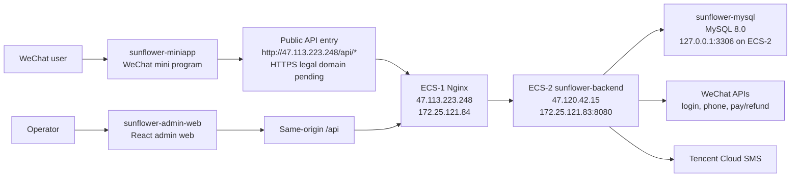

# Architecture

> Current as of 2026-06-08.

This project is a WeChat mini program plus admin web system for Sunflower
guesthouse booking, operations, payments, and private-domain customer service.

## 1. System Overview



## 2. Repository Layout

- `sunflower-miniapp/`: WeChat mini program, native miniapp pages plus TDesign miniprogram components.
- `sunflower-admin-web/`: admin web, React 18 + TypeScript + Vite + TDesign React.
- `sunflower-backend/`: Spring Boot monolith, Java 11, Spring Boot 2.7, Spring MVC, JPA, Flyway, MySQL.
- `deploy/nginx/`: host Nginx template for public admin/API ingress.
- `scripts/`: deployment and validation scripts used by the GitHub deployment workflow.
- `docker-compose.yml`: local/full-stack compose.
- `docker-compose.backend.yml`: backend-node compose for ECS-2.
- `docker-compose.web.yml`: web-node compose for ECS-1.
- `docs/archive/`: historical stage plans, reports, and old gate documents. Not active process requirements.

## 3. Runtime Components

### WeChat Mini Program

- Main MVP pages live under `sunflower-miniapp/pages/mvp/*`.
- API calls go through `sunflower-miniapp/utils/mvp/api.js`.
- Default API base is defined in `sunflower-miniapp/utils/mvp/runtime-config.js`.
- Current default is `http://47.113.223.248`, used for local/DevTools
  validation only.
- Preview/release builds must use a legal HTTPS request domain configured in
  the WeChat miniapp backend. User-provided备案 domains are
  `xiangrikui.cloud` and `sunflower.cloud`, but the final API hostname,
  trusted certificate, DNS, and WeChat legal request-domain configuration are
  still pending evidence.

### Admin Web

- Built with React, Vite, TypeScript, React Router, TanStack Query, Axios, and TDesign React.
- Local dev uses Vite proxy for `/api` to the backend.
- Production image serves static assets from Nginx inside the `sunflower-admin-web` container.
- Browser API calls use same-origin `/api`, which host Nginx proxies to ECS-2 backend.

### Backend

- Spring Boot monolith exposes all miniapp and admin APIs under `/api`.
- Main modules include auth/user/room/order/content/admin/payment/media.
- Persistence uses MySQL with Flyway migrations in `sunflower-backend/src/main/resources/db/migration`.
- Production profile uses environment-provided `DB_URL`, `DB_USERNAME`, and `DB_PASSWORD`.
- Health endpoint: `/api/health`.

### Database and Storage

- MySQL 8.0 runs on ECS-2 as `sunflower-mysql`.
- MySQL is bound to `127.0.0.1:3306` on the backend host.
- Backend avatar uploads are stored in Docker volume `sunflower_backend_uploads`.
- MySQL data is stored in Docker volume `sunflower_mysql_data`.

## 4. Production Topology

Production runs on two Alibaba Cloud ECS instances:

| Node | Public IP | Private IP | Role | Main services |
| --- | --- | --- | --- | --- |
| ECS-1 | `47.113.223.248` | `172.25.121.84` | web / ingress | host Nginx, `sunflower-admin-web`, public API reverse proxy |
| ECS-2 | `47.120.42.15` | `172.25.121.83` | backend / data | `sunflower-backend`, `sunflower-mysql` |

Traffic flow:

1. Mini program and admin web call the public entry on ECS-1.
2. ECS-1 host Nginx serves admin web and proxies `/api/*`.
3. ECS-1 reaches ECS-2 backend over the private network at `172.25.121.83:8080`.
4. Backend reads/writes MySQL locally on ECS-2.

Current observed status:

- ECS-1: Alibaba Cloud Linux 3, Nginx active, `sunflower-admin-web` healthy on `127.0.0.1:18080`.
- ECS-2: Ubuntu 22.04, `sunflower-backend` and `sunflower-mysql` healthy.
- Backend host port `8080` is hardened by binding the published port to ECS-2
  private IP `172.25.121.83:8080`, preserving ECS-1 private upstream access
  while direct public backend `8080` is not usable from the local probe
  network.
- Latest read-only production audit passed in Round 100, including public/ECS
  internal smoke and backend `8080` exposure checks. Real WeChat Pay
  production config is still incomplete, so payment/refund evidence remains
  pending.

## 5. Deployment Pipeline

Only one GitHub Actions workflow is active:

- `.github/workflows/deploy-backend.yml`

Triggers:

- Push to `main` for deployment-relevant paths.
- Manual `workflow_dispatch` with target `auto`, `backend`, `admin-web`,
  `nginx`, `all`, or `bootstrap`.
- Manual `workflow_dispatch` also supports `deployment_lane=production` and the
  backend-only `deployment_lane=nonprod-mock-payment` lane.

High-level flow:

1. Detect changed target areas.
2. Build backend/admin-web Docker images on GitHub-hosted runners when needed.
3. Package the deployment bundle on a GitHub-hosted runner and upload it as a
   workflow artifact, avoiding repository checkout on ECS deploy runners.
4. Upload image artifacts and push GHCR fallback tags.
5. ECS-2 self-hosted runner downloads the deployment bundle/image artifacts and
   deploys backend.
6. ECS-1 self-hosted runner downloads the deployment bundle/image artifacts and
   deploys admin-web.
7. ECS-1 reloads host Nginx for ingress changes or full deployments.

Deployment evidence boundary:

- Push to `main` and default manual dispatch remain production-lane.
- The backend-only nonprod/mock-payment lane validates and deploys only ECS-2
  backend with mock payment overlay; it does not refresh admin-web/Nginx and
  does not prove real payment or refund readiness.
- Current full production current-branch deployment remains pending until real
  WeChat Pay config/key files, HTTPS legal domain, and post-deploy smoke are
  recorded or explicitly waived.
- Before any push, merge, `workflow_dispatch`, or deploy intended to satisfy
  `CURRENT-BRANCH-DEPLOYED`, run
  `node scripts/check_deployment_approval_preflight.js` on a clean worktree and
  obtain explicit approval.

There is no active GitHub PR gate workflow. Historical stage gates and PR guard
documents are archived under `docs/archive/`.

## 6. Local Development

Backend:

```bash
cd sunflower-backend
mvn -B test
```

Admin web:

```bash
cd sunflower-admin-web
npm ci
npm run dev
```

Compose:

```bash
docker compose up -d mysql backend
```

Production compose rendering checks:

```bash
docker compose -f docker-compose.backend.yml --env-file .env.prod.example config
docker compose -f docker-compose.web.yml --env-file .env.prod.web.example config
```

## 7. Configuration Ownership

- Real production `.env.prod` files live on ECS hosts and are not committed.
- `.release.env` is generated by the deployment workflow on each deploy.
- `.env.prod.example` and `.env.prod.web.example` are templates only.
- Local private keys and secrets should stay under `.secrets/`, which is ignored by Git.

## 8. Active Process Notes

- Development is no longer stage-locked.
- No branch prefix, commit prefix, stage report, pre/post stage guard, or PR gate is required.
- Agent memory entry points are `docs/Agent-Memory.md`, `docs/Context-Index.md`,
  `docs/Project-State.md`, and `docs/Decision-Log.md`.
- Run focused tests for changed areas when practical.
- Keep API contracts backward-compatible unless callers and API docs are updated together.
